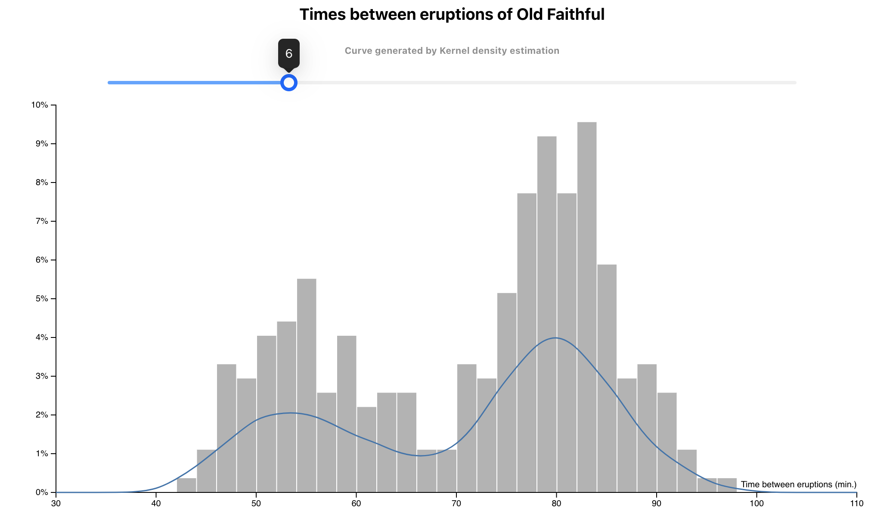
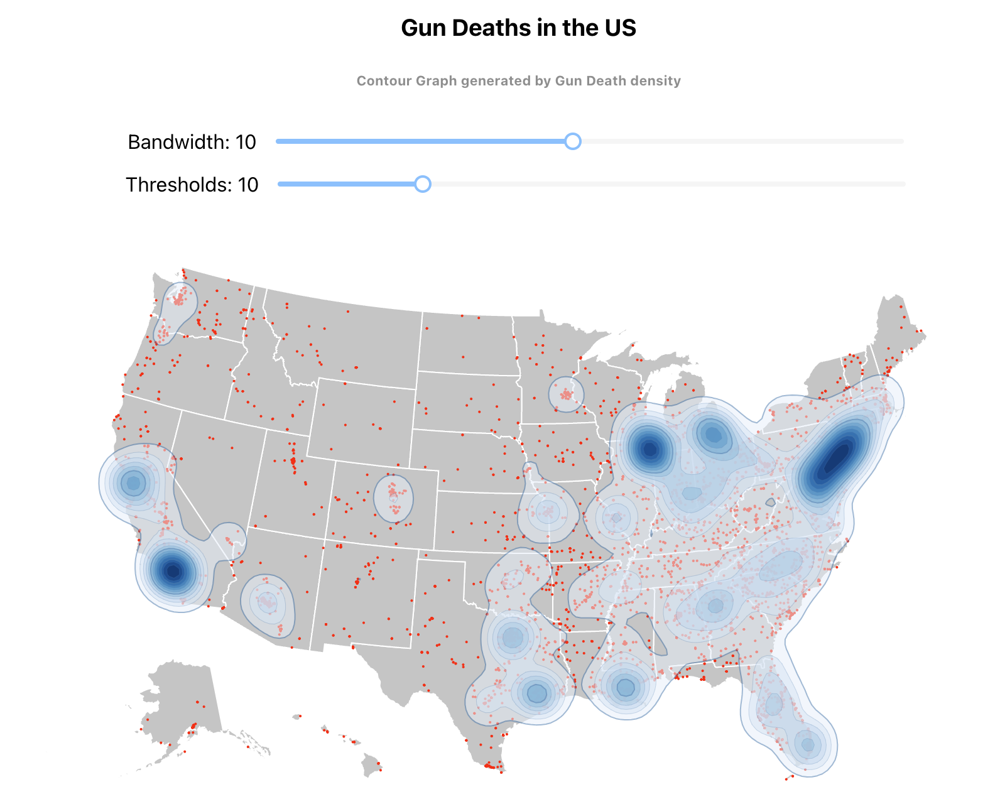

# SplatterPlot
Influenced by this [paper](https://ieeexplore.ieee.org/document/6484064), as an exercise I generated the eruption time of Old Faithful Spring and the US Gun death contour map based on **Kernel density estimation**.

# Kernel density estimation(KDE)
[KDE](https://en.wikipedia.org/wiki/Kernel_density_estimation#:~:text=In%20statistics%2C%20kernel%20density%20estimation,based%20on%20kernels%20as%20weights.) estimates the probability distribution of a random variable. The kernel’s bandwidth determines the estimate’s smoothness: if the bandwidth is too small, the estimate may include spurious bumps and wiggles; too large, and the estimate reveals little about the underlying distribution.

# ScreenShots

